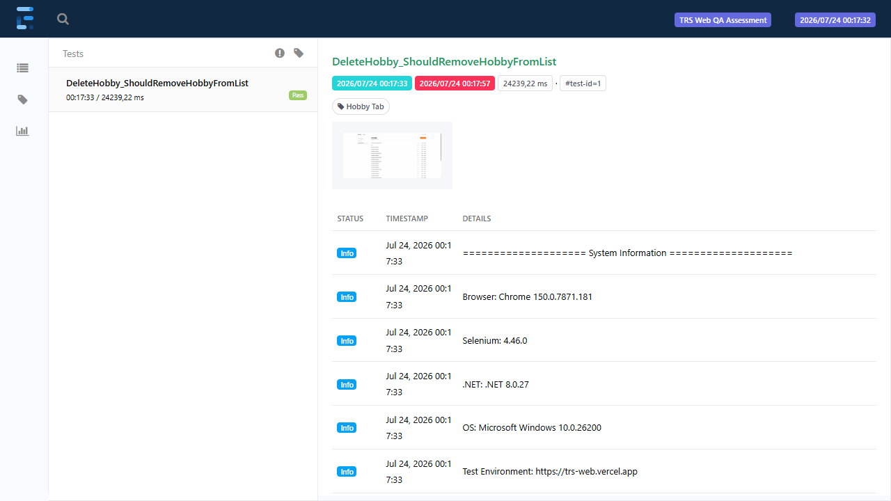

# TRS.Web.Automation

Selenium/NUnit UI test automation suite for the [TRS Web](https://trs-web.vercel.app) demo application, covering authentication, people management, hobby management, and a full end-to-end user journey. Test runs produce a rich HTML report (via ExtentReports) with step-by-step logs, screen recordings, and screenshots on failure.

## Where to Find the Reports

- **QA Assignment report** (test approach, decision tables, test cases, defects/observations): [`TRS QA Assignment — Sekhwari Masindi.docx`](<TRS QA Assignment — Sekhwari Masindi.docx>), at the repo root.
- **Generated ExtentReports HTML + recordings** (produced locally each time you run `dotnet test`, not committed to the repo): `Reports/yyyy-MM-dd/TestReport_yyyyMMdd_HHmmss.html` — see the [Reports](#reports) section below for details and a screenshot.

## Tech Stack

- **.NET 8** / C#
- **Selenium WebDriver 4.46** (ChromeDriver)
- **NUnit 4** test framework
- **ExtentReports 5** for HTML reporting
- **SixLabors.ImageSharp** for GIF screen recordings

## Project Structure

```
Configuration/   App settings (base URL, paths, test credentials)
Models/          Immutable result records returned by page actions (e.g. LoginResult, AddHobbyResult)
Objects/         Locator repositories — one static class per page, holding only By locators
Pages/           Page objects — one class per page/feature, encapsulating actions built from Objects/ locators
Assertions/      Assertion helpers — one static class per feature, keeping Assert.That calls out of test bodies
Tests/           NUnit test fixtures
Utilities/       Cross-cutting helpers (ExtentReports setup, screen recording, network capture, waits)
Reports/         Generated HTML reports and recordings (git-ignored, created on first run)
```

This follows the **Page Object Model**, split into two layers:
- `Objects/*Locators.cs` holds only `By` locators (a locator repository).
- `Pages/*Page.cs` holds the actions/behavior built from those locators, plus a `Submit*` convenience method per test scenario that performs the action and returns a result record for assertions.

Tests never touch a `By` locator or call `Driver.FindElement` directly — they call page-object methods, log an `Expected:`/`Actual:` pair, then hand the result to an `Assertions` helper.

## Prerequisites

- [.NET 8 SDK](https://dotnet.microsoft.com/download/dotnet/8.0)
- Google Chrome (matching ChromeDriver is resolved automatically by Selenium Manager)

## Setup

1. Clone the repository.
2. Copy the local settings template and fill in real test credentials:
   ```
   cp Configuration/appsettings.local.json.example Configuration/appsettings.local.json
   ```
   ```json
   {
     "LoginEmail": "your-test-email@example.com",
     "LoginPassword": "your-test-password"
   }
   ```
   `appsettings.local.json` is git-ignored — never commit real credentials. `Configuration/appsettings.json` holds the non-secret defaults (base URL, page paths) and is merged with the local file at runtime by `AppSettingsProvider`.

## Running the Tests

Run everything:
```
dotnet test
```

Run a single fixture or test by name:
```
dotnet test --filter "FullyQualifiedName~HobbyTests"
dotnet test --filter "FullyQualifiedName~AddHobby_ShouldAppearInHobbiesList"
```

Run by NUnit category:
```
dotnet test --filter "Category=Login Tests"
```

Tests run **sequentially** (`AssemblySettings.cs` sets `ParallelScope.None`) — each test gets its own Chrome session (`[FixtureLifeCycle(LifeCycle.InstancePerTestCase)]`), but fixtures don't run concurrently, since parallel runs previously caused report file-write collisions and timing races against the shared live demo environment.

## Test Suite Overview

| Fixture | Category | Covers |
|---|---|---|
| `LoginTests` | Login Tests | Valid/invalid login, logout |
| `SignUpTests` | Sign Up Tests | Sign-up with a unique generated email |
| `PersonTests` | People Tab | Add / edit / delete a person via the People grid; blank-field validation; duplicate email; name length boundary |
| `HobbyTests` | Hobby Tab | Add / edit / delete a hobby via My Hobbies; blank-field validation; duplicate hobby name |
| `DashboardTests` | Dashboard | Hobby Distribution chart reflects a newly added hobby |
| `EndToEndTests` | End To End Tests | Full journey: Sign Up → Login → Add Person → Add Hobby → Link Hobby → verify Dashboard → Logout → verify the linked hobby |

Unique test data (emails, hobby names) is generated per run using a short GUID-derived suffix, so tests can run repeatedly without colliding with existing data.

## Known Application Defects Documented by This Suite

A few tests are written against the **correct expected behavior** and are expected to fail until the underlying app is fixed — this documents real defects found in the TRS Web app rather than masking them:

- **`DeletePerson_WhenConfirmed_ShouldNotAppearAfterRefresh`** — selecting a person and clicking "Delete" on the People grid clears the row selection but never actually deletes the user; the row is still present after a page reload.
- **`EditPerson_WhenClicked_ShouldDisplayEditDialog`** — the "Edit" menu item on a People-grid row is a dead link (empty `href`); no edit dialog ever opens.
- **`AddHobby_WithDuplicateName_ShouldBeRejectedOrFlagged`** — Add Hobby silently allows creating a second hobby with an identical name (no error, no rejection); since Edit/Delete are matched by name text, duplicates make those actions ambiguous.

Do not "fix" these tests to pass without first confirming the underlying app behavior has actually been corrected.

## Reports

Each run generates an ExtentReports HTML report and per-test screen-recording GIFs, organized by the date the run started:
```
Reports/yyyy-MM-dd/TestReport_yyyyMMdd_HHmmss.html
Reports/yyyy-MM-dd/Recordings/<TestName>_<timestamp>.gif
```

This `Reports/` folder is git-ignored and only appears locally after you run `dotnet test` — open the newest `.html` file in a browser to view the results of your run.

Every test logs, in order:
1. A **System Information** block (browser, Selenium, .NET, OS, target environment) — helps reproduce environment-specific issues.
2. Step-by-step actions as they happen (navigation, form input, clicks).
3. An **`Expected:` / `Actual:`** pair immediately before each assertion, so the report demonstrates *what should happen* alongside *what did happen*, not just a final pass/fail.
4. A screen-recording GIF of the whole test, and a screenshot on failure.

NUnit `[Category]` attributes are also assigned to the Extent test, so the report's category view lines up with `dotnet test --filter Category=...`.

Example report view:



## Note on the Target Environment

`https://trs-web.vercel.app` is a shared, publicly-reachable demo deployment, not an isolated test environment. Other concurrent users/testers can add or remove data at any time. Assertions that check the app's own global aggregate figures (e.g. dashboard totals) are written to tolerate this — see `EndToEndTests`, which smoke-checks the dashboard renders well-formed statistics rather than asserting an exact before/after delta, and instead verifies specific outcomes (e.g. a linked hobby) by checking test-owned data directly.

### Accumulated Test Data

Repeated automation runs (from this suite and other testers) have left the environment with 100+ users and 60+ hobbies. This is permanent for users because Delete on the People grid doesn't actually persist (see BUG-001 below) — there is no way to clean that up from the UI, only from the app's own backend/database. Hobby delete does work, so hobby clutter could be cleaned up through the UI if needed, but the leftover users cannot be removed without direct backend access on the app owner's side.

If you're reviewing this project live, a database reset beforehand would make the walkthrough easier to follow.
